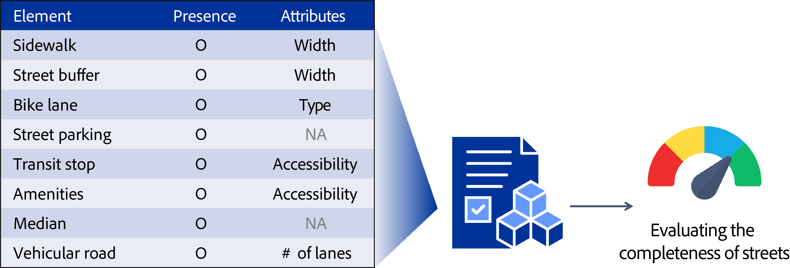

# 📍 Overview

This repository provides code, workflows, and example datasets for evaluating Complete Street completeness at the street-segment level.

The workflow identifies and measures eight key Complete Street elements, then integrates them into a composite Complete Street score using metrics informed by established Complete Streets design guidelines. The goal is to enable scalable evaluation of street conditions across cities.

<p align="left">  </p>

<br>

Several street elements (i.e., sidewalk, street buffer, bike lane, street parking, and transit stop) are measured using street view or aerial imagery combined with computer vision techniques, while other elements rely on open GIS or OSM datasets.

<br>

👉 Please visit our <a href="https://gt-cura.github.io/complete_streets_web/">project website fto explore the full methodology, interactive maps, and additional details

# ✨ Features
## 1. step1_loader: *Road Segment Preparation*
Preprocesses input road geometries to generate point- and line-based representations of target street segments. 
These outputs serve as the spatial backbone for element-level data collection in subsequent steps.

## 2. step2_elements: *Element-Level Data Collection*
Each subfolder corresponds to one Complete Street element and contains tools to collect presence and attribute.
- Each element may require a specific data source, model, or conda environment. Please refer to the `README.md` in each subfolder for detailed instructions.
- If Google Street View or satellite imagery is needed, set up an API key via the Google Cloud Console (read [instruction](https://support.google.com/googleapi/answer/6158841)) and enable the relevant APIs (e.g., Street View Static API for downloading Street View imagery). Free usage is limited by monthly quotas.
- Users may skip any element if equivalent datasets are already available or preferred.
- `POINT_EPSG4326.geojson` is a sample dataset provided to help users perform a preliminary analysis and better understand the workflow.

## 3. step3_score: *Composite Score Construction*
Aggregates element-level outputs from Step 2 to compute a final Complete Street score.
- We provide scoring rules and weights for each element.
- Element scores are normalized and combined to produce a composite score on a 0–100 scale.

<br>

# 📂 Repository Structure
```
complete-street/
│
├── README.md    # High-level description
├── LICENSE
│
│
├── step1_loader/
│   ├── README.md
│   ├── loader_env.yaml
│   └── generate_points_lines.ipynb
│
│
├── step2_elements/    # Element-specific pipelines
│   ├── amenities/
│   │   ├── README.md
│   │   └── amenities_weigths.csv
│   ├── bike_lane/
│   │   ├── POINT_EPSG4326.geojson
│   │   ├── README.md
│   │   ├── bike_lane_env.yml
│   │   ├── classify_bikelanes.py
│   │   └── train/
│   ├── median/
│   │   └── README.md
│   ├── sidewalk/
│   │   ├── POINT_EPSG4326.geojson
│   │   ├── README.md
│   │   ├── manual_collection/
│   │   ├── outputs_automation/
│   │   └── utils_automation/
│   ├── street_buffer/
│   │   ├── POINT_EPSG4326.geojson
│   │   ├── README.md
│   │   ├── manual_collection/
│   │   ├── outputs_automation/
│   │   └── utils_automation/
│   ├── street_parking/
│   │   ├── POINT_EPSG4326.geojson
│   │   ├── README.md
│   │   ├── 1_sign_detection.ipynb
│   │   ├── 2_vehicle_detection.ipynb
│   │   ├── 3_seg_level_prediction.ipynb
│   │   ├── neurvps_env.yaml
│   │   ├── street_parking_env.yaml
│   │   ├── result_map.html
│   │   └── vehicle_detection/neurvps/
│   ├── transit_stop/
│   │   ├── README.md
│   │   ├── requirements.txt
│   │   ├── data/
│   │   ├── gtfs_pipeline/
│   │   └── scripts/
│   └── vehicular_road/
│       └── README.md
│
│
└── step3_scoring/
    └── README.md
```
