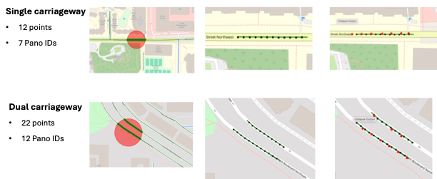

# Generate Points and Lines for Street-Level Image Sampling

This notebook (`generate_points_lines.ipynb`) creates spatial inputs—street segment lines and evenly spaced sampling points—for use in downstream street-level analyses such as parking sign or vehicle detection.

---

## Objective

To prepare a set of **line** and **point geometries** that:
- Represent road segments within the area of your choice.
- Provide regularly spaced coordinates for downloading or analyzing Google Street View imagery 

---

## Workflow Overview

### **1. Load Required Spatial Data**
- Import road centerlines from OpenStreetMap (OSM) using `geopandas`, `shapely`, and `osmnx` libraries.

### **2. Clean and Filter Road Network**
- Keep relevant street types (e.g., primary, secondary, residential).
- Reproject data to a *projected CRS* (e.g., EPSG:32616 in the Atlanta Metropolitan Region) for distance-based calculations.

### **3. Segment Roads into Uniform Lengths**
- Split long road geometries into segments and select a single, representative 30-meter segment.

### **4. Generate Sample Points Along Segments**
- Compute points at an equal interval of 5-meter along each segment’s geometry.
- Make a GSV metadata API call to retrieve the geographical coordinates (longitude, latitude) of each sampled point.
- Deduplicate the points and save ones with unique geographical coordinates
- Assign unique `point_id`s for the filtered points.

### **5. Export Results**
- Save generated features for use in later workflows:
  - `points.geojson` or `points.csv` — sampling locations.
  - `lines.geojson` — segmented road geometries.

---

## 📁 Output Files

| File | Description |
|------|--------------|
| `LINE_EPSG4326.geojson`  | Segmented street line geometries |
| `POINTS_EPSG4326.geojson` | Evenly spaced sample points along street segments |
| (optional) `map_points_lines.html` | Interactive visualization of results |

---

## Example Use Cases

- **Street-level image collection:** Query Google Street View or Mapillary imagery at each sampled point.  
- **Infrastructure audits:** Define observation units for sidewalk or signage detection models.  
- **Parking detection workflows:** Feed generated points into image-based detection pipelines (e.g., YOLO models for sign and vehicle detection).

---

## ⚙️ Dependencies

Core Python packages typically used in this notebook:
```bash
geopandas
shapely
osmnx
pandas
folium