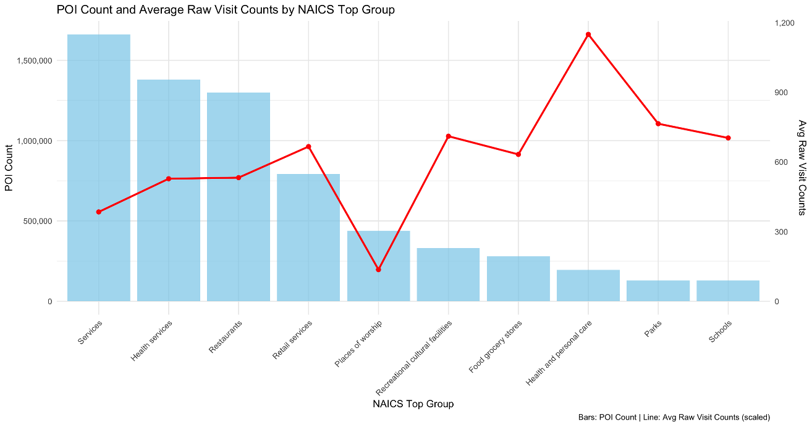
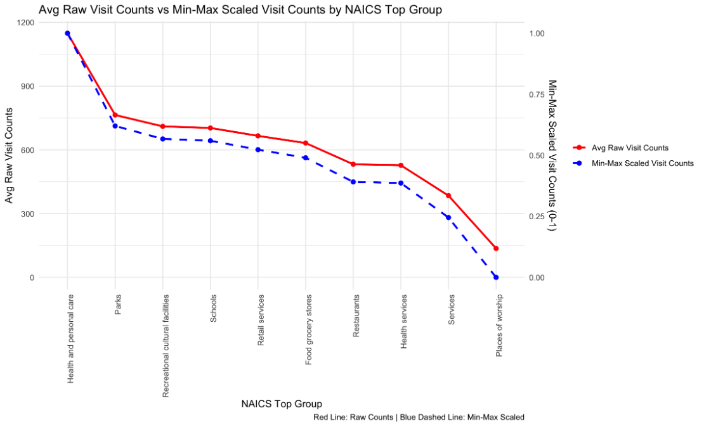
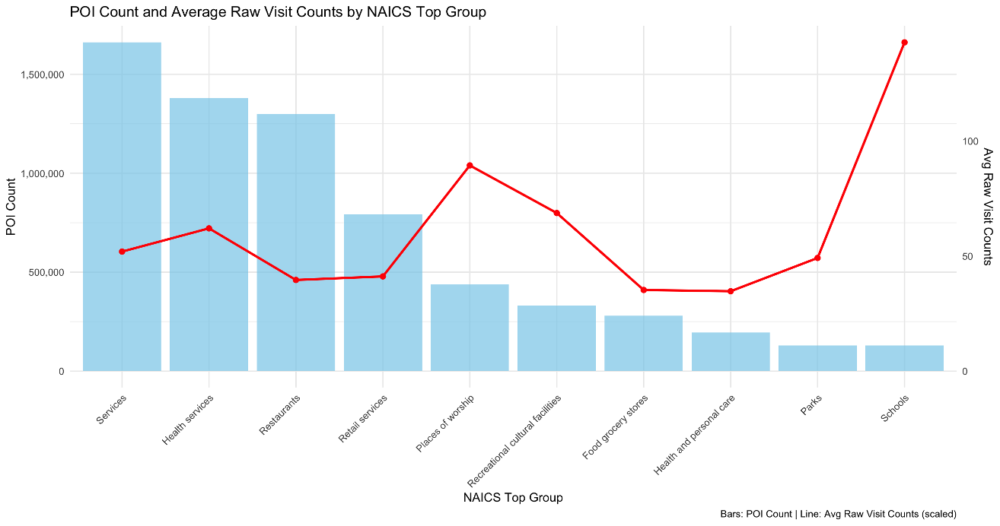
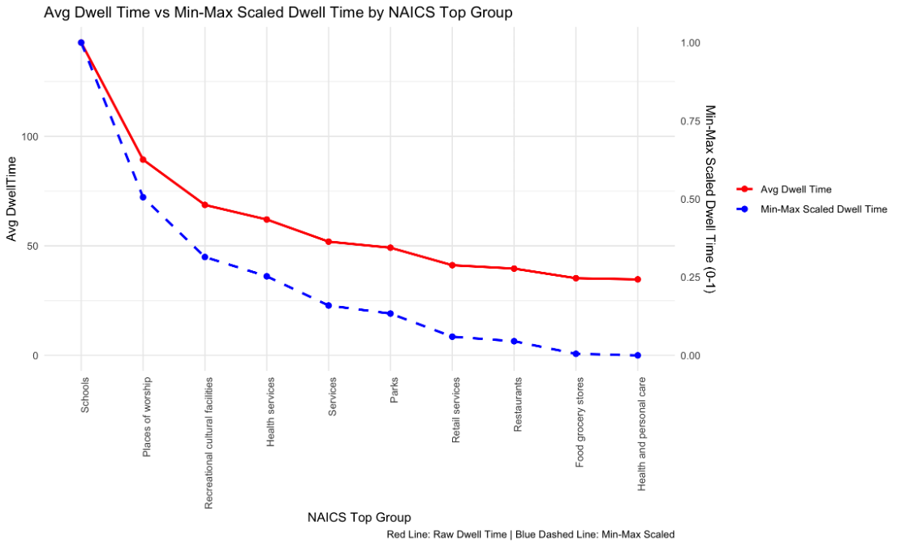
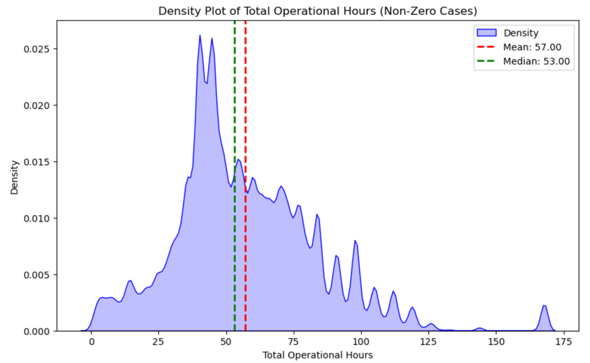

# Evaluation of Accessibility to Amenities

## 📍 Objective
This repository provides a framework to evaluate accessibility to daily amenities (i.e., points of interest) for given road segments. It demonstrates how to derive a composite accessibility index that accounts for amenity density, amenity importance, and road length through four main steps.

- **Input:**
  1. A GeoJSON file of road segment points.
  2. CSV table defining amenity-type weights (based on NACIS codes and behavioral factors).
- **Process:**  
  1. Generate walksheds (reachable areas) around each road segment point.
  2. Collect daily points of interest (POIs) within each walkshed.
  3. Assign weighted values to POIs using standardized popularity, intensity, and operating hour metrics.
  4. Aggregate the weighted POIs into a composite accessibility score that reflects both POI density and road length
- **Output:**  
  - The composite accessibility score for each road segment.

## 📦 Features:
- **`POINT_EPSG4326.geojson`**
  Example input file (5 sample points in Atlanta). Replace with your own points of interest.

- **`amenities_weigths.csv`**  
  Contains standardized popularity and intensity scores for each amenity type (based on NAICS codes). These values are used to assign behavioral weights to each POI.

## 🚗 Quick Guide

This repository outlines the analytical logic rather than providing a ready-to-run Python script, since multiple tools can be used for each spatial step.

To conduct the analysis:

### 1. Generate a Walkshed
- Center point: Use the midpoint of each road segment.
- Distance type: *Eucledian distance* or *Network-based distance*. Tools such as <a href="https://www.here.com/docs/bundle/isoline-routing-api-developer-guide-v8/page/README.html" target="_blank">HERE API</a> can automate generating a network-based walkshed more easily.
- Distance threshold: Defined based on your purpose - either a distance (e.g., 800 meters) or travel time (e.g., 10-minute walk)

### 2. Collect POI Data
Collect amenities supporting daily needs, following the 15-minute city framework. This analysis includes 10 major amenity types. Next, identify the POIs located within the walkshed.

**Amenity Categories Considered (N = 10)**
| Type | Category | NAICS Code(s) | Example Descriptions |
|:----:|:----------------------------|:----------------------|:------------------------------------------------|
| 1 | **Food / Grocery Stores** | 4451##; 4452## | Grocery stores; Specialty food stores |
| 2 | **Health & Personal Care** | 4461## | Pharmacies; Drug stores; Cosmetics and beauty supplies |
| 3 | **Health Services** | 6211##; 6212##; 6213##; 6214## | Offices of physicians, dentists, outpatient care centers |
| 4 | **Parks** | 712190 | Nature parks and similar institutions |
| 5 | **Places of Worship** | 813110 | Religious organizations |
| 6 | **Recreational / Cultural Facilities** | 7111##; 7112##; 712###; 7131##; 7139## | Performing arts; Sports; Amusement parks |
| 7 | **Restaurants** | 7224##; 7225## | Drinking places (alcoholic beverages); Restaurants |
| 8 | **Retail Services** | 448###; 451###; 452###; 453### | Clothing; Sporting goods; Bookstores; General merchandise |
| 9 | **Schools** | 6111## | Elementary and secondary schools |
| 10 | **Services** | 812###; 522###; 491110 | Beauty salons; Laundry; Pet care; Postal services |

Obtain POI data with location, NAICS code, and operating hours from platforms such as SafeGraph, Google Places, Yelp, or ADVAN. *While not all platforms support these attributes, ADVAN and SafeGraph do*

### 3. Compute Accessibility Scores
Once you’ve identified all accessible POIs, compute a weighted composite score following the method below.

## 🔎 Methodology - Calculating a weighted composite score
Not all amenities contribute equally to daily life. Each POI's importance (**mj**) is defined by three components:
  1. Popularity (**pop**): *How much an amenitiy attracts vistis*
  2. Intensity (**int**): *How long people dwell*
  3. Operating hour (**opr**): *How long the amenity remains open to the public*

You can refer to `amenities_weigths.csv`, which contains the standardized popularity and intensity score for each amenity type. *Note* The POI data were obtained from ADVAN (time period: October 2024).

### 1️⃣ Popularity
To calculate the standardized popularity score for each amenity type, we first computed the average monthly visit count for all POIs within each category across the United States. In the figure below, the blue bars represent the total number of POIs per category, while the red points indicate the mean number of visits. For example, restaurant-related POIs receive an average of approximately 362 monthly visitors.

  

We then applied Min–Max normalization to these mean visit counts to derive a standardized popularity score for each type.

  

### 2️⃣ Intensity
We first calculated the average dwell time, which is the mean of median dwell times for POIs across the US.

  

Next, using a similar logic like popularity, the standardized intensity score was retrieved.

  

### 3️⃣ Operating Hours
Lastly, we accounted for each POI's weekly operating hours. Among 9.8 million POIs in the U.S., 68% reported operating hour data, with a median of 53 hours per week. 

  

Amenities operating longer than this median were assigned higher weights: **opr = 1.5** if weekly hours > 53; otherwise **1.0**

### 🏛️ Composite POI Weight
Each POI's individual weight is calculated as:

**mj = oprj × (1 + popj) × (1 + intj)**

- **opr** = 1.5 if weekly operation hours exceed 53 hrs; otherwise **1**  
- **pop** = Min–Max standardized popularity score  
- **int** = Min–Max standardized intensity score  

The multiplicative form assumes compounding effects of **popularity**, **intensity**, and **operating hours**.

### 🧲 Composite Accessibility Score
For each road segment i:

**AmenityAccessibilityi** = ( ∑j *mj* ) / *Ni* × (1 + ln(*N* + 1)) ÷ ln(*li*)

- **i** = road segment identifier  
- **j** = POI within the buffer of road segment *i*  
- **li** = length of road segment *i*  
- **Ni** = number of POIs around segment *i*  
- **mj** = weight assigned to POI *j*

This formulation balances amenity density with segment length.

### References
If you use this model, please cite the following paper:
