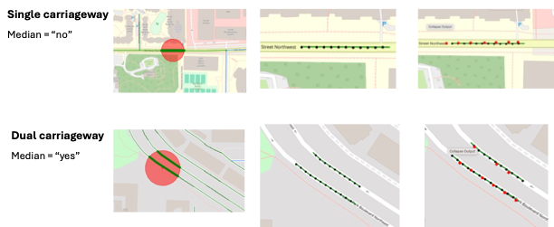

# Finding Medians on Roads

## 📍 Objective
This guide provides tools to automatically identify **physical medians** (dividers between opposite traffic directions) for each road segment in an urban street network.  
- The algorithm implemented in `step1_loader/generate_points_lines.ipynb` determines whether each segment belongs to a **single carriageway** or a **dual carriageway** based on the geometric relationships between nearby road centerlines.  
- Using this information, we infer the presence of a road median for each segment.

### Input
The input required is the same as that used in `generate_points_lines.ipynb` — a road network dataset (e.g., shapefile or GeoJSON) containing individual road centerline geometries.

### Process
1. Load and preprocess road centerlines into a uniform projected coordinate system.  
2. Generate evenly spaced sample points along each segment to represent its alignment.  
3. Calculate the **bearing** (direction) of each segment to identify its travel orientation.  
4. Search for **parallel, opposite-direction** segments located within a specified distance threshold (e.g., 8–15 meters).  
5. Classify segments as **dual carriageways** if such pairs are found; otherwise, label them as single carriageways.  
6. Assign `median = "yes"` for dual carriageways and `median = "no"` for all others.  

### Output
A CSV file showing the information on the presence of road median for each road segment:
- `median`: `"yes"` (dual carriageway) or `"no"` (single carriageway)

 
 

## 🚗 Quick Guide
### 1. Environment Setup
- Use the same Python environment as specified for `step1_loader` (which includes `osmnx`, `geopandas`, `shapely`, and `pandas`).

### 2. Run the Automated Pipeline  
- The `generate_points_lines.ipynb` notebook implements the geometric analysis pipeline for median detection under the `step1_loader` directory.  
- It includes functions for loading, cleaning, and analyzing road segment geometries.
