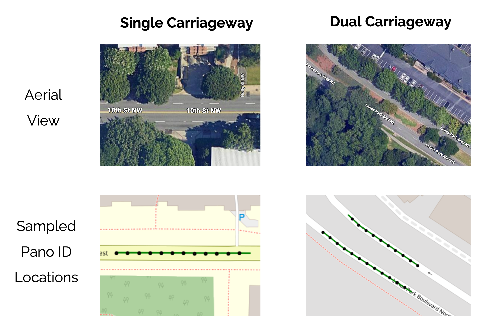

# Finding Medians on Roads
## 📍 Objective
This repository provides tools to automatically identify **physical medians** (dividers between opposite traffic directions) for each road segment

The algorithm in `step1_loader/generate_points_lines.ipynb` retrieves road linestrings and infers the presence of the median on road based on several geometric relationships between adjacent linestrings. Detail proceesses are described as follow.

 

### Input
The same input used in `generate_points_lines.ipynb`, typically a GeoJSON file containing:
  - Road LineString geometries (`YOUR_ROADS.geojson`) or
  - A study area polygon (`YOUR_STUDY_AREA.geojson`)
### Output
A CSV file showing the presence of median on road through a binary indicator:
- `median`
   - `"yes"` for dual carriageways 
   - `"no"` for single carriageways

 
 

## Workflow 
### 1. Download the OSM Road Network  
   - Retrieve nearby road geometries using **OSMnx** with a custom highway filter  
     (`"trunk|primary|secondary|tertiary|residential|unclassified"`).  
   - The function `graph_from_point()` builds a subgraph centered on each COI.  

### 2. Preprocess Network Data  
   - Compute directional bearings for each edge (`ox.bearing.add_edge_bearings`).  
   - Project the graph into an appropriate UTM CRS for spatial distance operations.  

### 3. Find Nearest Edges
   - Calculate Euclidean distance between each road edge and the COI.  
   - Keep the two closest edges (`edges_nearest`) as potential carriageway pairs.  

### 4. Determine Road Type 
   - Calculate the **bearing** (direction) of each segment to identify its travel orientation.  
   - Search for **parallel & opposite-direction** segments located within a specified distance threshold (e.g., 15 meters). This essentially checks if both nearest edges are one-way and have opposite bearings.
   - If such pairs are found, classify the segment as a **dual carriageway**
      - a road that has a single continuous surface or strip for traffic travelling in both directions, with no central reservation or physical barrier to separate opposing flows
   - Otherwise, label the segement as a **single carriageway**
      - a road where the traffic flowing in opposite directions is separated by a physical barrier or strip of land

  

### 5. Determine the Presence of Median
   - Assign `median = "yes"` for dual carriageways and `median = "no"` for single carriageways. 

### 6. Save
   - Save a new road segment record containing: `link_id`, `osmid`, `road_type`, `median`, and `geometry`.

 
 

## 🚗 Quick Guide
Please refer to the [step1_loader README file](../../step1_loader/README.md)