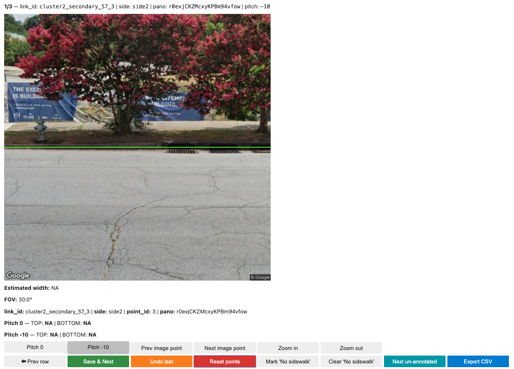

# Manual Sidewalk Width Annotation Tool

## 📍 Objective
Our automated pipeline estimates sidewalk width from street view imagery using semantic segmentation and geometric reasoning. In many cases, it works well, but it can fail when:
- The sidewalk is very close or very far from the camera  
- The viewpoint is misaligned with the roadway  
- There is strong occlusion (cars, vegetation, pedestrians, etc.)  
- Lighting / shadows are extreme  
- Driveways / parking lots look similar to sidewalks  
- The segmentation model simply makes mistakes  

<br>

Because we don't have a perfect segmentation model (and can't handle every issue automatically), this tool provides a **Jupyter-based manual annotation interface** that enables users to directly mark sidewalk edges, explore alternative imagery, and compute an estimated sidewalk width.

### Input:
- A GeoJSON file of road segment points (Same as used in the automated tool)
- CSV files of sidewalk width estimates (Stored in the `outputs_automation` directory produced by the automated tool)

### Process:
1. Identify cases from the automated tool that have invalid width estimates (NaN or out-of-range values).  
2. Load the original pre-downloaded street view images for these invalid cases.  
3. Move the camera location or adjust zoom level to obtain clearer sidewalk visibility.  
4. Manually mark the top and bottom edges of the sidewalk for both pitch 0° and pitch −10° images.  
5. The tool automatically computes the estimated sidewalk width and writes results to a CSV file.

### Output:
- A CSV file for each input case containing the estimated `width`. 
- All newly downloaded images (for zoomed or moved viewpoints) are saved locally under the `/outputs` directory.

<br>
<br>

## 📦 Features:
- **Jupyter Lab Scripts (.ipynb)** 
  1. **0_filter.ipynb**: Identifies invalid cases where the automated tool produced NaN or unrealistic widths (e.g., <1.0 m or >5.0 m). 
  2. **1_manual_annotation.ipynb**:  Launches the interactive Jupyter-based annotation interface for manual correction.
     
- **`invalid_cases.csv`** *example output*  
  Contains all road segment points where the automated sidewalk width estimation failed or produced implausible results. These cases require manual annotation using the interactive tool. *Example output*

- **`valid_cases.csv`** *example output*  
  Includes all records with valid sidewalk width estimates within the acceptable range.


- **`/outputs`** *example output*  
  Stores newly downloaded imagery and the final annotation CSV file (`manual_collection_invalid.csv`).

<br>
<br>

## 🚗 Quick Guide

### 1. Create and Activate a Conda Environment
  ```bash
  conda create -n sidewalk_manual python=3.10 -y
  conda activate sidewalk_manual
  ```

### 2. Install Dependencies
  ```bash
  conda install -c conda-forge numpy pandas geopandas scipy requests pillow ipywidgets ipyevents jupyterlab -y
  pip install ipywidgets jupyterlab_widgets
  ```

### 3. Register the Jupyter Kernel
  ```bash
  python -m ipykernel install --user --name sidewalk_manual --display-name "sidewalk_manual"
  ```

### 4. Launch JupyterLab
Open JupyterLab using the kernel `sidewalk_manual`
  ```bash
  jupyter lab
  ```

### 5. Run `0_filter.ipynb`
Open and execute the notebook `0_filter.ipynb`. This script scans all output CSV files generated by the automated sidewalk width estimation tool and classifies them into two categories:
- Valid cases – sidewalk widths that fall within the acceptable range
- Invalid cases – sidewalk widths that are either missing (NaN) or unrealistic (too small or too large)

These invalid cases will later be reviewed and corrected in the manual annotation interface.

### 6. Run `1_manual_annotation.ipynb`
Open and execute the notebook `0_filter.ipynb`. In the first cell, update the paths and API key so they match your environment. After editing these values, run the next cell. It will start the manual annotation interface, which looks like this:

<p align="center">  </p>

To estimate the sidewalk width, click the top and bottom edges of the sidewalk in both pitch views (0° and −10°).
After placing all four points, the tool automatically computes and displays the estimated width in meters.

<br>

If the sidewalk is not clearly visible or the image quality is poor, you can use the following buttons to explore alternative imagery. Additional controls are also provided to help you perform the annotation step by step:
- Prev row / Save & Next: Move to the previous/next record in the invalid cases.
- Pitch 0 / -10: Toggle between the two vertical viewing angles (0° and −10°) for the same pano.
- Prev / Next image point: Move backward/forward along the road segment to a different camera location for the same link/side. The tool downloads new street view images.
- Zoom in / out: Decrease/increase the field of view (FOV). The tool downloads new street view images.
- Undo last: Remove the most recently placed point (bottom first, then top) for the current pitch.
- Reset points: Clear both top and bottom points for the current pitch.
- Mark / Clear 'No Sidewalk': Flag the current location as having no sidewalk, or remove that flag.
- Next un-annotated: Jump to the next row that does not yet have a valid estimated width and is not marked as “No sidewalk”.
- Export CSV: Save all current annotations and the computed estimated_width values (e.g., `manual_collection_invalid.csv` inside `/outputs`.)

*Note* Don’t forget to click **Export CSV** before exiting the interface to ensure all annotations are saved. Each time you zoom in/out or move the camera location, the tool makes one Google Street View API call.

### References
If you use this model, please cite the following paper: 

```bibtex
@article{your_article,
  title   = {A novel approach for estimating sidewalk width from street view images and computer vision},
  author  = {Lieu, S. J., & Guhathakurta, S.},
  journal = {Environment and Planning B: Urban Analytics and City Science},
  year    = {2025}
}
