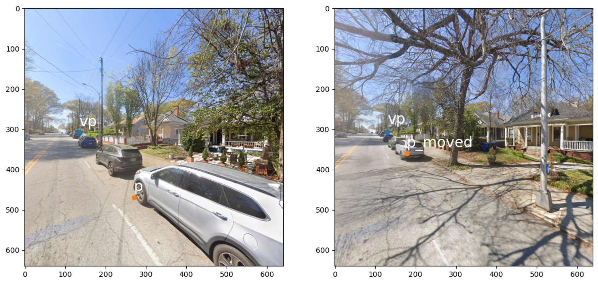

# Street Parking Detection Pipeline

This repository contains three Jupyter notebooks that together form a full pipeline for detecting parking signs, identifying parked vehicles, and finally, predicting street parking activities for each road segment.  
The workflow is designed to be executed in the following order:

---

## 1️⃣ 0_sign_detection.ipynb — Parking Sign Detection

### Purpose
Detects parking signs from Google Street View (GSV) using a fine-tuned YOLO model.

### Main Steps
- Download GSV images of the sampled geographical point coordinates from `./../../step1_loader` and save them to `img/`.
- Load trained YOLO model (`./model_sign_detection.pt`).
- Read input images from `img/`.
- Run inference to detect all visible parking signs.
- Filter detections by confidence threshold (e.g., `> 0.3`).

### Output Files
- `sign_detection/` — annotated images with bounding boxes drawn for illustration purposes (optional).
- `result_sign_detection.csv` — structured output of sign detection results for subsequent analyses (required).

---

## 2️⃣ 1_vehicle_detection.ipynb — Stationary Vehicle Detection

### Purpose
Detects vehicles parked along street segments to support inference of actual parking occupancy.


### Main Steps
#### vehicle instance segmentation
- Load a pretrained YOLO segmentation model (`yolo11s-seg.pt`). No need to fine-tune because vehicles are one of the classes in the pretrained model.
- Read and process input images from `img/`.
- Extract segmentation masks for vehicles.
#### vanishing point detection
- Install the `neurvps` conda environment using `neurvps_env.yaml`.
- Detect a vanishing point for each image containing vehicle masks.
- Attach the detected vanishing point to the vehicle mask information.
#### geometric projection
- Identify parked vs. moving vehicles using geometric projection algorithms. The coordinates of vehicle masks on the next image will be projected by using vanishing points as reference points.

### Output Files
- `result_vehicle_detection.csv` — each record includes the distance error of geometric projection and the cosine similarity of two masks capturing presumably identical vehicles.

---

## 3️⃣ 2_seg_level_prediction.ipynb — Segment-Level Parking Prediction

### Purpose
Integrates the detection results from signs and vehicles to classify whether each road segment has *on-street parking* activities or not.


### Main Steps
- Load input data:
  - `result_sign_detection.csv`
  - `result_vehicle_detection.csv`
  - `LINE_EPSG4326.geojson` - GeoJSON of road segments extracted from the `./../../step1_loader` step.
- Join detections to corresponding street segments using the `link_id` keys.
- Assign `Parking` to road segments having either at least one `permit` sign or at least one parked vehicle and `No Parking` for the rest.

### Output Files
  - `result_map.html` — interactive map visualization.
  - `result_street_parking.csv` — road segment-level predicted label (parking = True/False).

---

## 🧭 Execution Order

Run the notebooks **in order**:

1. `0_sign_detection.ipynb` → generates sign detections  
2. `1_vehicle_detection.ipynb` → generates vehicle detections  
3. `2_seg_level_prediction.ipynb` → integrates both and outputs segment-level results  

---

## ⚙️ Environment Setup

You can create the Conda environment for the overall workflow using:
```bash
# under the workdir: step2_element/street_parking
conda env create -f env_street_parking.yaml
conda activate env_street_parking
conda install -c conda-forge jupyterlab ipykernel # (don't skip this)
# unset PYTHONPATH
# python -m ipykernel install --user --name env_street_parking --display-name "Python (env_street_parking)"
```

You need to create a separate Conda environment, originially developed by Zhou et al. (2019), for the vanishing point detection step:
```bash
# under the workdir: step2_element/street_parking
# the following installation guide is quoted from Zhou et al. (2019)
conda env create -f env_neurvps.yaml
conda activate env_neurvps
pip install torch==2.1.2+cu121 torchvision==0.16.2+cu121 --index-url https://download.pytorch.org/whl/cu121
```
Download the checkpoint for neurvps (tmm17_checkpoint_latest.pth.tar) from Yichao Zhou's Hugging Face site (https://huggingface.co/yichaozhou/neurvps/blob/main/Pretrained/TMM17/checkpoint_latest.pth.tar). Save it under "./vehicle_detection/neurvps/checkpoint".

Please ensure to cite Zhou et al. (2019)'s paper if you are using the vanishing point detection method! 

## Reference
- Yichao Zhou, Haozhi Qi, Jingwei Huang, Yi Ma. "NeurVPS: Neural Vanishing Point Scanning via Conic Convolution". NeurIPS 2019. https://doi.org/10.48550/arXiv.1910.06316