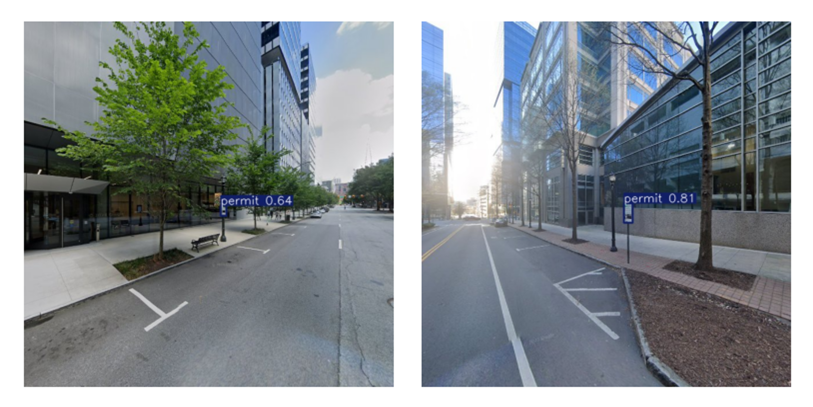
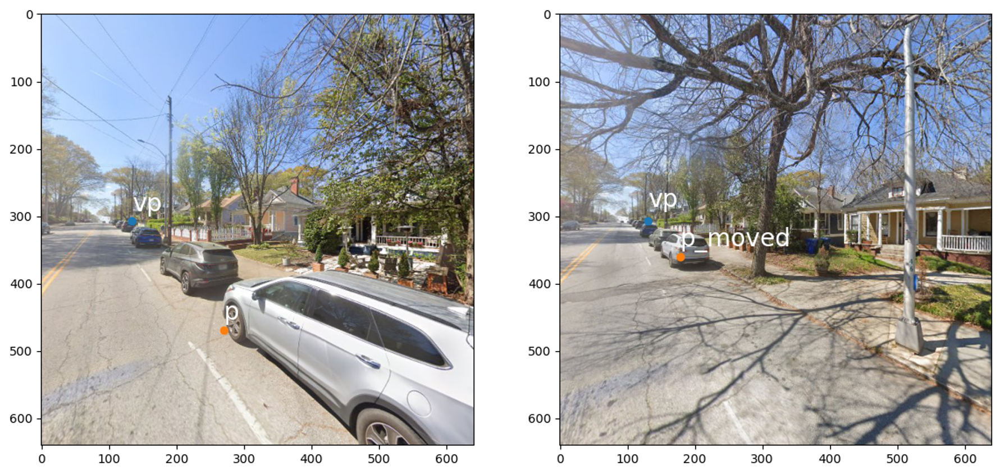

# Automated Street Parking Detection

## 📍 Objective
This repository provides a **computer vision–based workflow** for detecting parking signs, identifying parked vehicles, and predicting on-street parking activity at the **road-segment level**.

<p align="center">  </p>

### Input:
A GeoJSON file of road segment points. 

### Process:
1. Download Google Street View images on both sides of a road segment in a 10 meter interval (the downloading process is automated).
2. Detect **parking signs** using a *fine-tuned YOLO object detection* model.  
<p align="center">  </p>

3. Detect **vehicles** and classify them as stationary or moving using the *YOLO instance segmentation* model and *geometric projections*.  
<p align="center">  </p>

4. Merge sign and vehicle detections to classify each road segment as **Parking** or **No Parking**.

### Output:
- A CSV file (`result_street_parking.csv`) with **link_id** and **parking presence** ("yes" or "no").  
- An interactive HTML map (`result_map.html`) visualizing the predicted parking conditions.

<br>
<br>

## 📦 Features
- **`POINT_EPSG4326.geojson`**
  - Example input file (5 sample points in Atlanta). 
  - Replace with your own points of interest.

- **`1_sign_detection.ipynb`**
  - Detects parking-related signs from GSV imagery using 
  - Intermediate output saved as `result_sign_detection.csv`   

- **`2_vehicle_detection.ipynb`**
  - Detects vehicles and determines whether each of them stationary.
  - Intermediate output saved as `result_vehicle_detection.csv`   

- **`3_seg_level_prediction.ipynb`**
  - Integrates sign and vehicle detections with road segments.  
  - Classifies each segment as **Parking** or **No Parking**.  
  - Final output saved as `result_street_parking.csv` and `result_map.html`  

<br>
<br>

## 🚗 Quick Guide
### 1. Install Conda Environments

#### Main workflow
  ```bash
  conda env create -f street_parking_env.yaml
  conda activate street_parking_env
  unset PYTHONPATH  # avoids PROJ/GDAL CRS errors

  # Optional: To use jupyter notebook, execute the following
  conda install -c conda-forge jupyterlab ipykernel
  python -m ipykernel install --user --name street_parking_env --display-name "Python (street_parking_env)"
  ```

#### NeurVPS Vanishing point detection 
- A Python library developed by [Zhou et al. (2019)](https://github.com/zhou13/neurvps).
- Adopts Zhou et al. (2019)'s guide on `NeurVPS` installation.
```bash
conda env create -f neurvps_env.yaml # Please use the default environment name "neurvps_env"
conda activate neurvps_env
pip install torch==2.1.2+cu121 torchvision==0.16.2+cu121 \
    --index-url https://download.pytorch.org/whl/cu121
```

### 2. Prepare Input Data
- Place your point-of-interest or toy dataset (POINT_EPSG4326.geojson) in the working directory.
- GSV images from your points-of-interest will be downloaded automatically through the `1_sign_detection.ipynb` script.

### 3. Download Pretrained Weights
#### Fine-tuned Sign Detection model checkpoint
- Browser: 
  > Download from the Release asset:  
  > https://github.com/GT-CURA/complete_streets/releases/download/v0.1.1/street_parking_sign_detection.pt
  >
  > Save to the working directory: `./`

- Terminal
  ```bash
  curl -L \
  -o street_parking_sign_detection.pt \
  "https://github.com/GT-CURA/complete_streets/releases/download/v0.1.1/street_parking_sign_detection.pt"
  ```

#### Pre-trained NeurVPS checkpoint
- Browser: 
  > Access to Zhou et al. (2019)'s Huggingface page: 
  > https://huggingface.co/yichaozhou/neurvps/blob/main/Pretrained/TMM17/checkpoint_latest.pth.tar  
  > 
  > Save to: `./vehicle_detection/neurvps/checkpoint/`

- Please ensure to cite Zhou et al. (2019)'s paper if you are using the vanishing point detection method.

### 4. Run the Workflow
1. Open Jupyter Lab:
    ```bash
    jupyter lab
    ```
 
2. Run in the following order 
  - 1_sign_detection.ipynb
  - 2_vehicle_detection.ipynb
  - 3_seg_level_prediction.ipynb

3. Expected outputs:
  - result_street_parking.csv
  - result_map.html

<br>
<br>

### Reference
If you use this methodology or code, please cite: 

- Yichao Zhou, Haozhi Qi, Jingwei Huang, Yi Ma. "NeurVPS: Neural Vanishing Point Scanning via Conic Convolution". NeurIPS 2019. https://doi.org/10.48550/arXiv.1910.06316