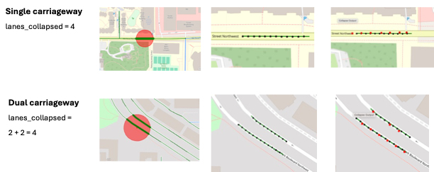

# Estimating Number of Lanes for Each Road Segment

## 📍 Objective
This guide explains the process of estimating the **number of lanes** for each road segment using OpenStreetMap (OSM) data.  
The algorithm in `step1_loader/generate_points_lines.ipynb` retrieves nearby road edges around a given coordinate of interest (COI) and determines both the **median presence** and **lane count** of the nearest segment(s).

We assign the total number of lanes per segment by collapsing and summing the OSM `lanes` attributes, accounting for dual carriageways when detected.

### Input
The same input used in `generate_points_lines.ipynb`, typically:
- A point-based GeoDataFrame defining road segment locations (COI)
- Radius or bounding box distance (`dist`) defining the search extent

### Process
1. **Download the OSM Road Network**  
   - Retrieve nearby road geometries using **OSMnx** with a custom highway filter  
     (`"trunk|primary|secondary|tertiary|residential|unclassified"`).  
   - The function `graph_from_point()` builds a subgraph centered on each COI.  

2. **Preprocess Network Data**  
   - Compute directional bearings for each edge (`ox.bearing.add_edge_bearings`).  
   - Project the graph into an appropriate UTM CRS for spatial distance operations.  

3. **Find Nearest Edges**  
   - Calculate Euclidean distance between each road edge and the COI.  
   - Keep the two closest edges (`edges_nearest`) as potential carriageway pairs.  

4. **Determine Road Type (Single vs Dual Carriageway)**  
   - Check if both nearest edges are one-way and have opposite bearings.  
   - If so → classify as **dual carriageway** and set `median = "yes"`.  
   - Otherwise → classify as **single carriageway** (`median = "no"`).  

5. **Estimate Number of Lanes**  
   - Collapse and clean the OSM `lanes` attribute using the `collapse_lanes()` function.  
   - If two opposing one-way segments form a dual carriageway, **sum** their lane counts.  
   - If the `lanes` attribute is missing, assign a default value of 1.  
   - Store the result in a new column `lanes_collapsed`.  

6. **Cut and Export Road Segment Geometry**  
   - Split the nearest edge at the projected COI location.  
   - Save a new road segment record containing:
     - `link_id`, `osmid`, `road_type`, `median`, `lanes_collapsed`, and geometry.

### Output
A CSV file showing the information on the presence of road median for each road segment:
- `lanes_collapsed`: total number of lanes (summed if dual carriageway)  
- `road_type`: OSM road classification  
- `length_new`: segment length (in meters)

## 🚗 Quick Guide
### 1. Environment Setup
- Use the same Python environment as specified for `step1_loader` (which includes `osmnx`, `geopandas`, `shapely`, and `pandas`).

### 2. Run the Automated Pipeline  
- The `generate_points_lines.ipynb` notebook implements the geometric analysis pipeline for median detection under the `step1_loader` directory.  
- It includes functions for loading, cleaning, and analyzing road segment geometries.