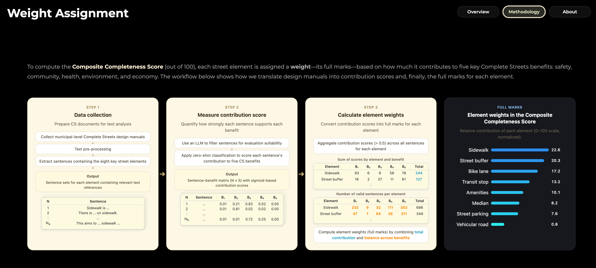
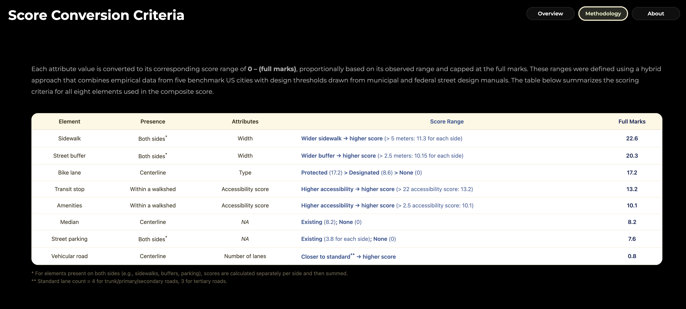

For details on the scoring framework, please refer to Pages 5 and 6 of our <a href="https://gt-cura.github.io/complete_streets_web/">project website</a>

 

### Page 5 (Weight Assignment)
Explains how weights are assigned to each Complete Street element based on their relative contributions to Complete Streets principles.

  

  

### Page 6 (Score Conversion Criteria)
Describes how raw element inventories are converted into standardized scores prior to aggregation.

  

